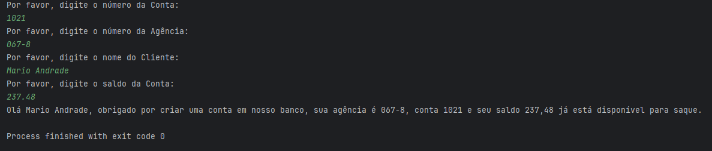

# 💻 Projeto: ContaBanco

Este projeto faz parte de um desafio prático proposto pelo DIO em parceria com o Santander no bootcamp **Santander 2025 - Back-End com Java** chamado **Simulando Uma conta Bancária através do Terminal/Console**. O objetivo é consolidar os conhecimentos básicos da linguagem Java, incluindo **declaração de variáveis**, **entrada de dados via terminal**, **uso da classe Scanner**, **concatenação de strings** e conceitos iniciais de **POO (Programação Orientada a Objetos)**.

---

## 📋 Descrição do Desafio

A proposta é criar um programa Java simples chamado **ContaBanco**, que simula a abertura de uma conta bancária, coletando informações do usuário via terminal.

---

## 🧰 Pré-requisitos

- Conhecimentos básicos em **Java**
- Noções de **Lógica de Programação** e **POO**
- Computador com sistema operacional de sua preferência (**Windows**, **Linux**, **Mac OS**)
- Uma **IDE** de sua escolha (**Eclipse**, **VS Code**, **IntelliJ IDEA**, etc)

---

## 📌 Objetivo

O programa deve:

- Solicitar os seguintes dados do usuário via terminal:

| Atributo       | Tipo     | Exemplo        |
|----------------|----------|----------------|
| Número         | Inteiro  | 1021           |
| Agência        | Texto    | 067-8          |
| Nome do Cliente | Texto   | MARIO ANDRADE  |
| Saldo          | Decimal  | 237.48         |

- Exibir ao final a seguinte mensagem personalizada:

```
Olá [Nome Cliente], obrigado por criar uma conta em nosso banco, sua agência é [Agencia], conta [Numero] e seu saldo [Saldo] já está disponível para saque.
```

> ⚠️ As informações entre `[ ]` serão substituídas pelos dados fornecidos pelo usuário.

---

## 🛠️ Estrutura do Projeto

```
src/
 └── ContaTerminal.java
 └── model/
      └── ContaBanco.java
```

---

## ✅ O que eu aprendi com esse projeto:

- Manipulação de entrada de dados com **Scanner**
- Uso de **records** para criação de classes imutáveis
- Formatação de strings com **String.format()**
- Princípios básicos de **POO em Java**
- Organização de projeto com **pacotes (package)**

---

## 📷 Exemplo de Execução:



---

## ✨ Conclusão

Esse desafio foi uma ótima oportunidade para reforçar os conceitos iniciais da linguagem Java, além de praticar a interação via terminal e organizar melhor o código seguindo boas práticas.
